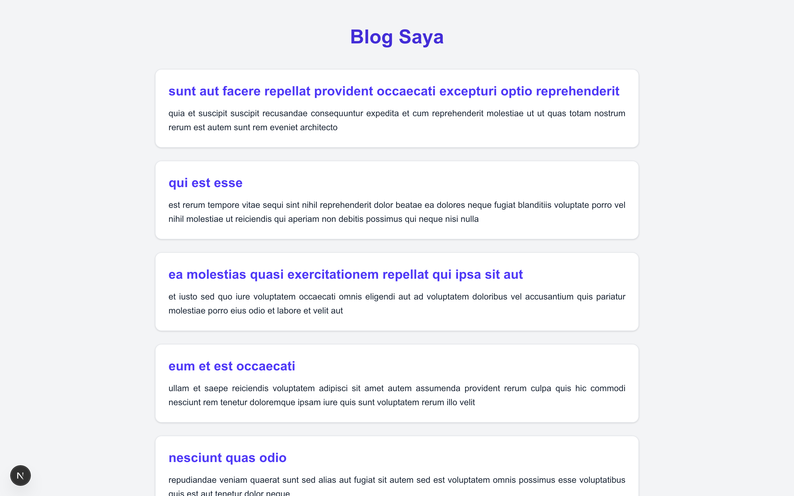
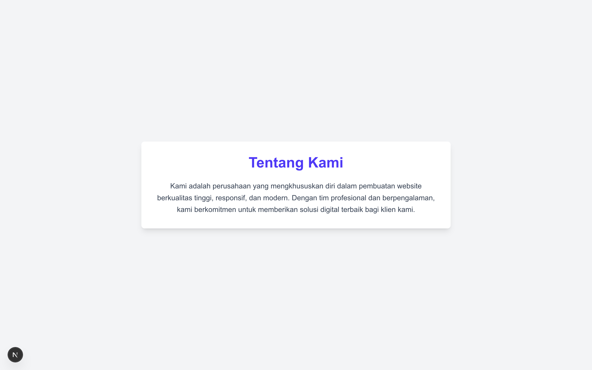
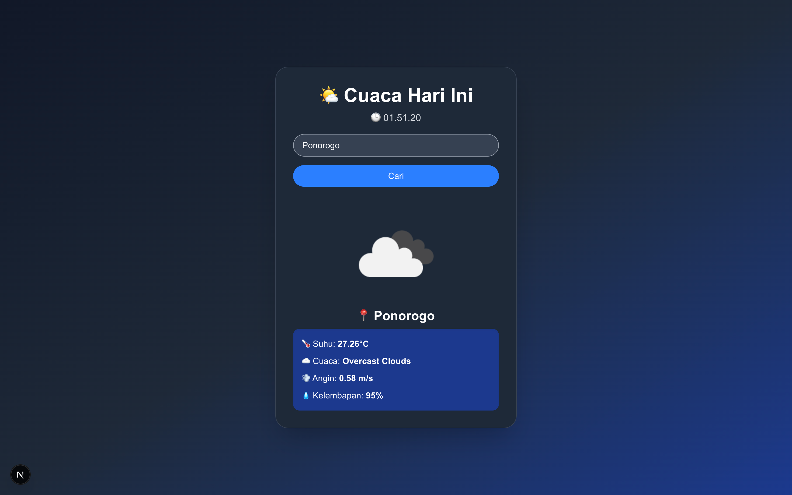

# Laporan Praktikum

|  | Pemrograman Berbasis Framework 2025 |
| ------ |-------------------------------------|
| NIM | 244107027004                        |
| Nama | Rafio Sadani                        |
| Kelas | TI - 4K                             |

## Langkah - Langkah Praktikum

1. Membuat halaman awal di file `index.js` menggunakan pendekatan Server Side Rendering (SSR)  
   

2. Mengembangkan halaman `blog` yang dihasilkan dengan metode Static Site Generation (SSG)  
   

3. Menambahkan fitur dynamic routing pada halaman `blog` berdasarkan parameter `slug`  
   

4. Membangun halaman `products` yang memuat data dari API endpoint `/api/products`  
   

5. Menambahkan navigasi pada halaman `index.js` yang mengarah ke halaman `Tentang Kami` menggunakan komponen `Link`  
   

## Tugas Praktikum

1. Membuat halaman baru menggunakan Static Site Generation untuk menampilkan daftar pengguna / users  
   

2. Mengimplementasikan routing dinamis untuk menampilkan detail user berdasarkan `id`  
   

3. Membuat halaman frontend yang menampilkan data cuaca dari API OpenWeatherMap dengan memanfaatkan API Routes  
   
